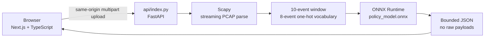

# PacketSentry

**AI-assisted network capture triage using a prototype behavioral model.**

PacketSentry is a small full-stack portfolio application that turns a safe, bounded `.pcap` upload into readable protocol context, modeled behavioral events, and a prototype risk signal. It is an experimental security/ML project—not a production intrusion-detection system and not a calibrated probability engine.

> Screenshot: after deployment, add a dashboard screenshot here (for example, `docs/packetsentry-dashboard.png`). The included one-click sample is the fastest way to reproduce the view.

## Try it locally

The canonical integrated workflow is Vercel CLI, because the browser and FastAPI function share the same origin:

```bash
npm install
python -m venv .venv
# Windows: .venv\Scripts\Activate.ps1
# macOS/Linux: source .venv/bin/activate
pip install -r requirements.txt
python tools/generate_demo_pcap.py
vercel dev
```

Open `http://localhost:3000`, then click **Try sample capture**. The sample is a deterministic synthetic capture and goes through the exact same `POST /api/analyze` path as a user-selected file.

For frontend-only iteration, `npm run dev` starts Next.js, but the analysis action requires the integrated Vercel function route. Backend tests use FastAPI directly and do not require a running server.

If you do not have Vercel CLI authentication available locally, run the two development processes below; Next.js forwards `/api/*` only in development:

```bash
python -m uvicorn api.index:app --reload --port 8000
npm run dev
```

## What is included

- Next.js App Router + TypeScript + Tailwind CSS frontend.
- FastAPI ASGI app exposed from `api/index.py` for Vercel Python Functions.
- Scapy PCAP parsing entirely in memory.
- ONNX Runtime inference against the committed `agents/policy_model.onnx` copied to `api/assets/policy_model.onnx`.
- Deterministic synthetic demo generator at `tools/generate_demo_pcap.py`.
- Bounded score timeline, modeled-event table, protocol distribution, and final-window sensitivity explanation.
- No authentication, database, persistent uploads, packet replay, external calls, or required secrets.

## Architecture



The frontend calls relative URLs (`/api/analyze` and `/api/health`). Vercel serves the Next.js page and Python function from one project. `.python-version` pins the server runtime to Python 3.12.

## API

### `GET /api/health`

Reports model initialization and the active safety limits:

```json
{
  "status": "ok",
  "model_loaded": true,
  "model_runtime": "onnxruntime",
  "max_upload_bytes": 3000000,
  "max_packets": 10000
}
```

### `POST /api/analyze`

Accepts a multipart field named `file`. Only `.pcap` is advertised in v1. The response includes scan metadata, threat score and level, protocol counts/percentages, bounded modeled events, a bounded score timeline, and final-window sensitivity hints.

Safety limits are enforced in both browser and backend:

| Limit | Value |
| --- | ---: |
| Upload size | 3,000,000 bytes |
| Packets parsed | 10,000 |
| Returned modeled events | 250 |
| Timeline points | 250 |
| Explanation items | 5 |

The parser recognizes these legacy mappings: TCP SYN → `open_socket`, TCP FIN → `close_socket`, and Scapy `Raw` payload presence → `read_file`. Protocol, port, and packet-index metadata are safe display fields; raw payload content is never returned or logged.

## Model methodology and limitations

The original packet-sniffer project defines eight event types and a ten-event sliding window of concatenated float32 one-hot vectors. The action at index `1` is treated as the prototype risk score, matching the original inference server. Display bands are `LOW < 0.55`, `MEDIUM 0.55–<0.75`, and `HIGH >= 0.75`; these are UI thresholds, not calibrated attack probabilities.

There is an important provenance detail: the committed ONNX artifact introspects as a 40-feature model (five event slots), while the canonical legacy runtime window is 80 features (ten slots). PacketSentry preserves the ten-event window for analysis and explanations, then feeds the ONNX Runtime adapter the final compatible model-width slots. The dashboard exposes both widths so this mismatch is visible rather than silently papered over. No retraining or benchmark improvement is claimed.

The model was trained on synthetic behavioral traces. The original project reports a known false-positive limitation on benign traffic. PacketSentry should be used for exploratory triage and portfolio demonstration, not as a production IDS verdict, automated blocking mechanism, or forensic conclusion.

## Tests and release gates

```bash
npm run lint
npm run build
pytest -q
```

The test suite covers feature dimensions, SYN/FIN/Raw mappings, real sample parsing, real ONNX inference, numeric score bounds, health, malformed PCAP handling, oversized uploads, bounded output, and the absence of raw payload text in responses. GitHub Actions repeats the Node and Python gates in `.github/workflows/ci.yml`.

## Vercel deployment

1. Import this repository into Vercel with the repository root as the project root.
2. Keep the framework as Next.js; no environment variables are required for v1.
3. Deploy and check `/api/health` before trying the homepage sample.
4. Add the live URL and a real dashboard screenshot to this README after deployment.

Do not add a second backend host or a CORS proxy: the deployment relies on Vercel's same-origin Next.js + Python function layout.

## Privacy and security behavior

Uploaded bytes are read into memory for one request and are not written to persistent disk. The service does not replay packets, resolve hosts from captures, execute payloads, construct shell commands from user input, or return raw payload data. Errors are converted into safe client messages; logs contain only byte size, packet count, modeled-event count, duration, and error category.

## History and provenance

PacketSentry revives the original `shriiyaaa/packet-sniffer` RL packet-sniffer project. The legacy repository contained Scapy capture mapping, a FastAPI event inference server, Streamlit UI, synthetic behavioral traces, and the `agents/policy_model.onnx` asset. This v1 keeps the event vocabulary and ONNX artifact while replacing the live-sniffer/Streamlit presentation with a bounded upload workflow suitable for a zero-configuration Vercel demo. Legacy scripts and checkpoints remain in the repository for provenance; the deployable path is isolated under `api/`, `app/`, `components/`, and `lib/`.

## Roadmap

- Validate and retrain a versioned model with real, carefully labeled traffic before any operational use.
- Add a documented PCAPNG path only after parser and payload-safety tests exist.
- Support larger private captures through private object storage and a durable job model.
- Add richer, independently validated protocol features and calibration metrics.
- Add authentication and retention controls if scan history becomes a product requirement.
